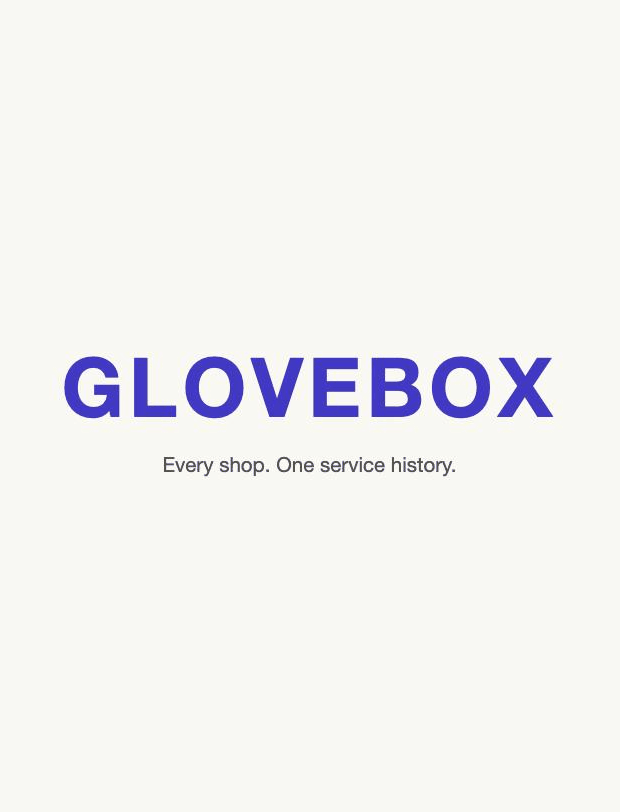

# Glovebox

Every shop. One service history. Owned by the driver, checkable by the next one.

<p align="center">
  
</p>

## The problem

Every repair shop keeps its own records for its own location. The Pep Boys in Ballard knows nothing about the Pep Boys in Queen Anne, let alone the Goodyear down the street or the dealer. Owners are left with emails and paper, which fail at exactly the moments they matter: selling the car, proving a warranty claim, or knowing which technician did what work.

CARFAX cannot close this. By their own documentation, records an owner adds are excluded from the Vehicle History Report, and the shop reporting feed carries no prices at all. Work at an independent shop, and work you did yourself, is structurally invisible to it.

The cost is concrete. Pay for brake work, lose the receipt, and six months later pay again for something that was still covered.

## What it does

**Tells you not to pay twice.** Before you authorize work, it checks whether the same system was already paid for at any shop inside a plausible coverage window, and quotes the earlier receipt back to you. This needs no warranty fine print to be legible, only what was done and when.

**Tracks coverage as it actually exists.** Lifetime brake pads with no expiry, prorated tire treadwear that pays a shrinking share, conditions like "original purchaser only" that decide whether a claim succeeds. Each one shows the receipt's own words, the odometer the check was made against, and a claim packet to put on the counter. It never asserts that something is covered, because the shop decides that from its own system.

**Answers what state the car is in.** Free text line items collapse into canonical services, so "last done" is answerable. Brake and tire measurements become a series with a direction, a wear rate, and a projected mileage at the legal limit. Odometer readings become a curve with a derived rate, gap detection, and rollback checks.

**Works on day one with no receipts.** A VIN yields the year, make, model, engine, and every open recall from NHTSA. Recalls have no time or mileage limit, are always free, and appear on no service receipt.

**Records the work nobody else can see.** DIY entry exists because a driveway oil change reaches no reporting system anywhere.

## How a record gets in

Photograph a receipt, upload a PDF, paste an emailed invoice, or log your own work. Every path produces a trust tier, because how a record arrived is the only thing a used car buyer can actually evaluate.

## Why the next owner should believe any of it

They should not, if the seller controls the record. The person with the most incentive to shade a history is the person holding the phone. So the product does not ask for trust; it makes the record expensive to fake and cheap to check.

- **Provenance over assertion.** Every record carries how it arrived, and the summary reports the mix rather than a score: shop originated, photographed and payment matched, photographed, owner entered.
- **Verifiability.** Each record shows what a skeptic could do to check it, usually calling the shop and reading back an invoice number.
- **Record age.** Timestamps are assigned by the database, never the client. A history maintained for years is credible in a way one assembled the week of the listing is not, and the product says which one it is looking at.
- **Append only.** Corrections are amendments with their own timestamps and deletions are soft. A seller can add to a history but cannot quietly remove the transmission repair.
- **Odometer continuity.** Rollback is the dominant used car fraud. A dense curve from independent sources is hard to fabricate, and density itself is the evidence.

## What it deliberately will not say

It will not score the car. A record with three visits in six years is either a neglected car or an incomplete record, and nothing here can tell the difference. Saying so is the honest answer, and treating a thin record as evidence of neglect would misprice a well kept car.

Service intervals are generic, not the manufacturer's schedule for a specific VIN. Real per VIN schedules are licensed data.

## Status

V1 prototype. Extraction is instructed to return null rather than invent a value, and every field it decides is shown to a human before anything is saved.

There is still no accuracy number. The eval harness exists and is wired to a real invoice (Pep Boys work order 2068633, scored field by field against ground truth someone checked off the paper), but it makes real API calls and has not been run. `npm run eval` with a key set produces the number. Until then, treat extraction quality as unmeasured, because it is.

Records live in Postgres scoped to an anonymous cookie. That is the current limit of the ownership story: whoever holds the cookie holds the garage. Real ownership needs real accounts.

Built with Next.js, Neon, and Claude.

## Running it

```
npm install
npm run db:setup   # applies the schema to DATABASE_URL
npm run dev
npm test           # deterministic core, no API key needed
npm run eval       # extraction accuracy, needs ANTHROPIC_API_KEY
```

Upgrading from an earlier build migrates any records held in browser storage on first load. Migrated records are marked as such, because their recorded date is the migration date and not when they were first captured.

`ANTHROPIC_API_KEY` is needed only for extraction. Everything else, including the VIN and recall lookups, runs without it.

## Reading the code

- `src/lib/taxonomy.ts` — canonical services. Least glamorous file here, and everything else stands on it.
- `src/lib/mileage.ts` — the odometer curve, and the anti fraud spine.
- `src/lib/warranty.ts` — coverage as it actually exists, including the kinds with no expiry.
- `src/lib/repeat.ts` — the do not pay twice check, and the counter check.
- `src/lib/provenance.ts` — trust tiers and what a buyer can verify.
- `src/lib/health.ts` — due next, wear over time, and the refusal to score.
- `src/lib/db/schema.sql` — why timestamps are server assigned and records are append only.
- `validation/` — the competitive scan, the interview kit, and the integration design.
